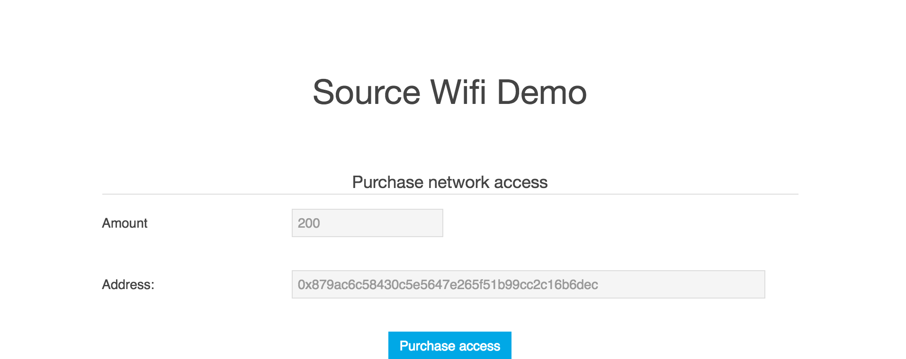

## Source

## Summary
This is a router that runs on the Rasberry Pi 3 and Raspbian OS. All requests
are routed to a Python-implemented webserver, which passes the request's data
to any applications subscribing to the server's feed.

HTTP requests are initially denied with a 402. A price for the request is
calculated on the packet size. Payment is then made for access to web.
